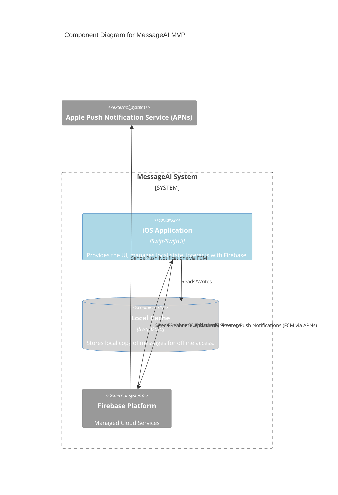
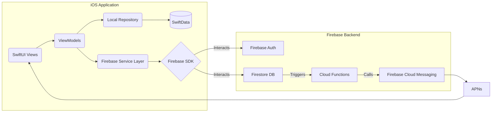
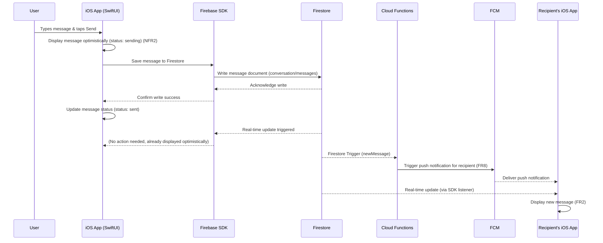
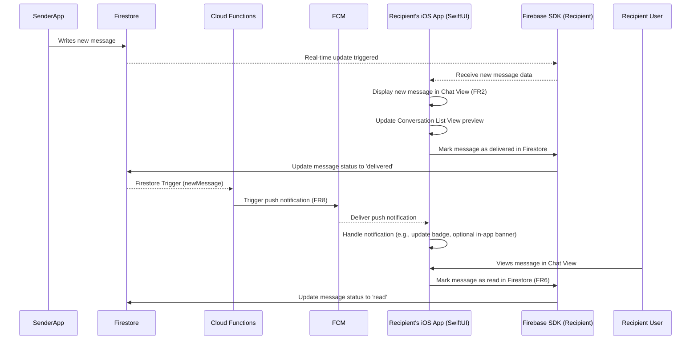
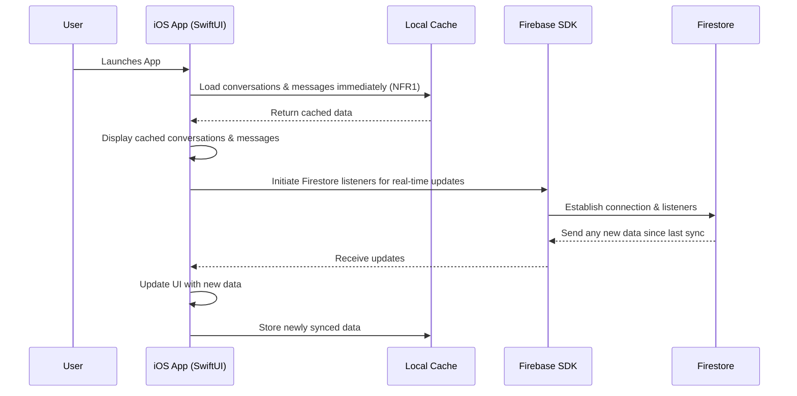
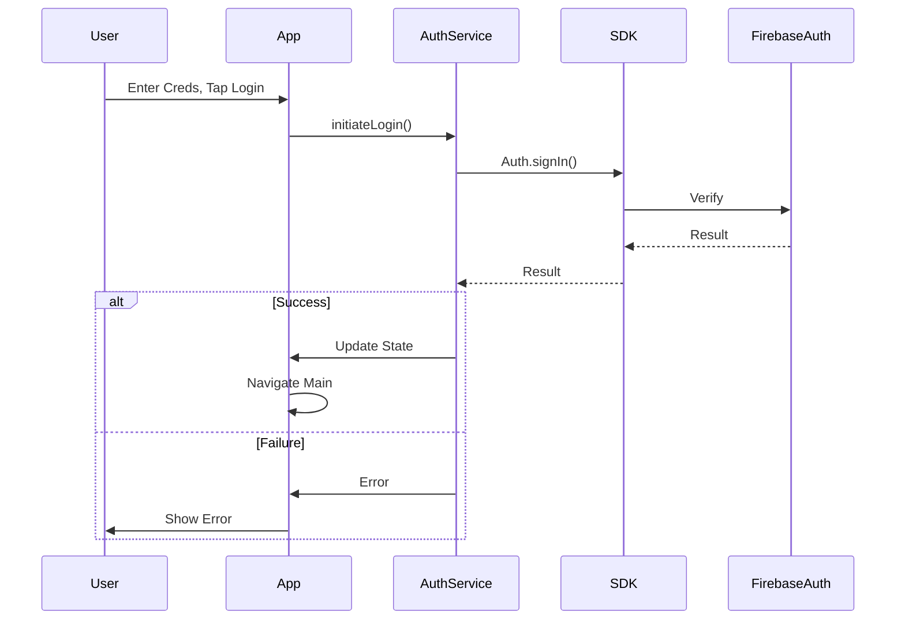

# MessageAI Fullstack Architecture Document

## Introduction

This document outlines the complete fullstack architecture for MessageAI, including backend systems (Firebase), the frontend iOS implementation (SwiftUI), and their integration. It serves as the single source of truth for AI-driven development, ensuring consistency across the entire technology stack. This unified approach combines backend and frontend architecture concerns for this modern mobile application.

### Starter Template or Existing Project

**Status**: N/A - Greenfield project.

**Rationale**: This is a new native iOS application. Development will likely begin using a standard Xcode project template for SwiftUI applications. Firebase SDKs and configurations will be added manually according to Firebase documentation and best practices. No specific pre-built "fullstack" starter template incorporating both native iOS and Firebase backend logic is being used.

### Change Log

| Date | Version | Description | Author |
|------|---------|-------------|--------|
| October 20, 2025 | 1.0 | Initial Architecture draft | Winston (Arch) |

## High Level Architecture

### Technical Summary

The MessageAI architecture follows a mobile-first, serverless approach. The frontend is a native iOS application built with SwiftUI, leveraging SwiftData for local persistence and offline capabilities. The backend relies entirely on Firebase services, including Firestore for real-time data synchronization and persistence, Firebase Auth for user management, Firebase Cloud Functions for serverless logic (like push notifications), and Firebase Cloud Messaging (FCM) for push delivery. Key architectural patterns include Offline-First design, Optimistic UI updates, and Real-time Synchronization to achieve the reliability and responsiveness goals outlined in the PRD.

### Platform and Infrastructure Choice

**Platform**: Firebase.

**Rationale**: Firebase directly provides the core real-time database, authentication, serverless functions, and push notification capabilities required by the PRD. Its tight integration with iOS and built-in handling of real-time sync and offline persistence significantly accelerates development towards the MVP goals.

**Key Services**:
- Firebase Authentication
- Firebase Firestore
- Firebase Cloud Functions
- Firebase Cloud Messaging (FCM)

**Deployment Host and Regions**: Firebase Hosting (if any web component needed later, otherwise N/A for pure backend services), Functions typically run multi-region or can be pinned (e.g., us-central1).

### Repository Structure

**Structure**: Monorepo.

**Rationale**: As specified in the PRD's technical assumptions, a monorepo structure will co-locate the iOS application code and the Firebase Cloud Functions code. This simplifies management, particularly if shared logic or types emerge later (though less common between Swift and Node.js/TypeScript for Functions).

**Monorepo Tool**: N/A (Standard folder structure within a single Git repository).

**Package Organization**: A root directory containing separate folders for the ios-app (Xcode project) and firebase-functions (Node.js/TypeScript project).

### High Level Architecture Diagram

```mermaid
graph TD
    subgraph "iOS Device"
        App[📱 MessageAI iOS App (SwiftUI)]
        LocalDB[(📁 SwiftData - Local Cache)]
    end

    subgraph "Firebase Cloud"
        Auth[🔒 Firebase Auth]
        Firestore[📄 Firestore (Real-time DB)]
        Functions[⚡ Cloud Functions (Node.js/TS)]
        FCM[📬 FCM (Push Notifications)]
    end

    App -- Authentication --> Auth
    App -- Real-time Sync --> Firestore
    App -- Read/Write --> LocalDB
    App -- Sends Message --> Functions
    Functions -- Writes to --> Firestore
    Functions -- Triggers --> FCM
    Firestore -- Real-time Updates --> App
    FCM -- Sends Push --> App

    style App fill:#cce5ff
    style LocalDB fill:#e5ccff
```

### Architectural Patterns

- **Serverless Architecture**: Using Firebase Cloud Functions for backend logic. **Rationale**: Aligns with PRD requirement for rapid deployment and automatic scaling.
- **Offline-First**: Leveraging SwiftData for local message caching and offline access. **Rationale**: Meets NFR1 for persistence and app availability during network outages.
- **Real-time Synchronization**: Utilizing Firestore's real-time listeners for instant message updates. **Rationale**: Meets FR2 for real-time delivery.
- **Optimistic UI Updates**: Updating the UI immediately upon user action (e.g., sending a message) before server confirmation. **Rationale**: Meets NFR2 for perceived app responsiveness.
- **Model-View-ViewModel (MVVM)**: Standard pattern for SwiftUI development. **Rationale**: Promotes separation of concerns, testability, and state management within the iOS app.
- **Repository Pattern (for Local Data)**: Abstracting SwiftData access logic. **Rationale**: Enables cleaner data management and easier testing of local persistence logic within the iOS app.

## Tech Stack

This section defines the definitive technology choices for the MessageAI project, based on the "Golden Path" specified in the PRD and project brief. All development must adhere to these specific technologies and versions.

### Technology Stack Table

| Category | Technology | Version | Purpose | Rationale |
|----------|-----------|---------|---------|-----------|
| Frontend Language | Swift | 5.9+ | Native iOS development language | Required for SwiftUI, provides safety and performance |
| Frontend Framework | SwiftUI | Latest | Declarative UI framework for iOS | Recommended for fastest iOS development, modern approach |
| UI Component Library | Native SwiftUI Components | N/A | Standard iOS UI elements | Provides native look, feel, and accessibility |
| State Management | SwiftUI (@State, @Observed...) | N/A | Built-in state management for SwiftUI | Sufficient for MVP scope, avoids external dependencies |
| Backend Language | TypeScript | 5.x | Language for Firebase Cloud Functions | Strongly typed JavaScript, good tooling, common for serverless |
| Backend Framework | Node.js | 18.x (LTS) | Runtime for Firebase Cloud Functions | Standard runtime for Firebase Functions, LTS for stability |
| API Style | N/A (Direct Firestore SDK) | N/A | Client interacts directly with Firestore | Simplifies MVP, leverages Firebase real-time sync |
| Database (Remote) | Firebase Firestore | N/A (Cloud) | Real-time NoSQL database | Core requirement for real-time sync, offline support |
| Database (Local) | SwiftData | iOS 17+ | Local persistence framework | Recommended for local storage, integrates well with SwiftUI |
| Cache | N/A (Handled by SwiftData) | N/A | Local persistence serves as cache | SwiftData provides offline caching mechanism |
| File Storage | Firebase Storage | N/A (Cloud) | (Post-MVP) For media messages | Integrated Firebase solution for file uploads (needed for image support) |
| Authentication | Firebase Auth | N/A (Cloud) | User authentication service | Handles sign-up, login, sessions securely |
| Frontend Testing | XCTest | Xcode Default | Native iOS unit/UI testing framework | Standard Apple testing framework |
| Backend Testing | Jest | Latest | Testing framework for Node.js/TypeScript | Popular choice for testing Firebase Functions |
| E2E Testing | XCUITest | Xcode Default | Native iOS end-to-end testing | Standard Apple framework for UI automation |
| Build Tool | Xcode | Latest | iOS application build system | Standard Apple IDE and build tools |
| Bundler | N/A (Handled by Xcode) | N/A | App bundling handled by Xcode | Standard iOS development process |
| IaC Tool | Firebase CLI / Console | Latest | Infrastructure management for Firebase | Standard way to manage Firebase resources |
| CI/CD | TBD (e.g., GitHub Actions, ...) | N/A | Continuous integration/deployment pipeline | To be decided based on repository host / preference |
| Monitoring | Firebase Monitoring/Crashlytics | N/A (Cloud) | Performance and crash reporting | Integrated Firebase tools for app health |
| Logging | Firebase Functions Logs / OSLog | N/A | Backend / Native iOS logging mechanisms | Standard logging tools for the respective environments |
| CSS Framework | N/A (Handled by SwiftUI) | N/A | Styling is done via SwiftUI modifiers | Native iOS styling approach |

## Data Models

This section defines the core data entities required for the MVP, considering both their representation in Firestore (backend) and how they might be structured locally with SwiftData (frontend).

### User

**Purpose**: Represents a registered user of the application.

**Key Attributes**:
- `userId`: string - Unique identifier (matches Firebase Auth UID).
- `displayName`: string - User's chosen display name.
- `email`: string - User's email address (optional, mainly for lookup).
- `presence`: string (enum: "online", "offline") - User's current status (FR7).
- `lastSeen`: timestamp - Timestamp of the user's last activity.

**TypeScript Interface (for Cloud Functions/conceptual sharing)**

```typescript
interface User {
  userId: string;
  displayName: string;
  email?: string;
  presence: 'online' | 'offline';
  lastSeen: FirebaseFirestore.Timestamp; // Or appropriate timestamp type
}
```

**Relationships**: None directly stored, linked implicitly via userId.

### Conversation

**Purpose**: Represents a single chat thread, either 1:1 or group.

**Key Attributes**:
- `conversationId`: string - Unique identifier for the conversation.
- `participants`: array<string> - List of userIds participating in this chat (FR1, FR3).
- `lastMessageText`: string - Preview text of the most recent message.
- `lastMessageTimestamp`: timestamp - Timestamp of the most recent message.
- `isGroupChat`: boolean - Flag indicating if it's a group chat (derived from participants.length > 2).

**TypeScript Interface (for Cloud Functions/conceptual sharing)**

```typescript
interface Conversation {
  conversationId: string;
  participants: string[];
  lastMessageText?: string;
  lastMessageTimestamp?: FirebaseFirestore.Timestamp;
  isGroupChat: boolean;
}
```

**Relationships**: Contains an array of userIds. Will contain a sub-collection of Message documents in Firestore.

### Message

**Purpose**: Represents a single message within a conversation.

**Key Attributes**:
- `messageId`: string - Unique identifier for the message.
- `senderId`: string - userId of the sender.
- `text`: string - The content of the message.
- `timestamp`: timestamp - When the message was sent (FR5).
- `status`: string (enum: "sending", "sent", "delivered", "read") - Delivery/read status (NFR2, FR6).

**TypeScript Interface (for Cloud Functions/conceptual sharing)**

```typescript
interface Message {
  messageId: string;
  senderId: string;
  text: string;
  timestamp: FirebaseFirestore.Timestamp;
  status: 'sending' | 'sent' | 'delivered' | 'read';
}
```

**Relationships**: Belongs to a specific Conversation (will be stored in a sub-collection in Firestore). Linked to a User via senderId.

## API Specification

**API Style**: N/A (Direct Firebase SDK Integration)

**Rationale**: For the MVP, the iOS client application will interact directly with Firebase Auth and Firestore using the official Firebase iOS SDKs. This approach leverages Firebase's real-time synchronization and offline persistence features directly on the client, simplifying the backend requirements for the core messaging functionality. An explicit API layer (like REST or GraphQL) is not required for the client-database interaction. Cloud Functions will be used for specific backend triggers (like push notifications) rather than serving a general-purpose API.

## Components

Based on the serverless architecture, native iOS client, and direct Firebase SDK integration, the major logical components and their responsibilities are:

### iOS Application (SwiftUI)

**Responsibility**: Provides the user interface, manages local application state, handles user input, interacts with local storage (SwiftData), and communicates directly with Firebase services (Auth, Firestore) via the Firebase SDK.

**Key Interfaces**: User Interface (Views), ViewModels (state and logic), Local Repository (SwiftData interaction), Firebase Service Layer (wrappers around Firebase SDK calls).

**Dependencies**: Firebase iOS SDK, SwiftData.

**Technology Stack**: Swift, SwiftUI, SwiftData.

### Firebase Authentication

**Responsibility**: Manages user sign-up, login, sessions, and provides user identity (UIDs).

**Key Interfaces**: Firebase Auth SDK methods (e.g., createUser, signIn, signOut, currentUser).

**Dependencies**: None (Managed Cloud Service).

**Technology Stack**: Firebase Cloud Service.

### Firebase Firestore

**Responsibility**: Stores and synchronizes application data (Users, Conversations, Messages) in real-time across connected clients. Enforces data access rules via Security Rules.

**Key Interfaces**: Firestore SDK methods (e.g., setData, updateData, addSnapshotListener, getDocuments). Firestore Security Rules.

**Dependencies**: None (Managed Cloud Service).

**Technology Stack**: Firebase Cloud Service (NoSQL Database).

### Firebase Cloud Functions

**Responsibility**: Executes server-side logic triggered by events (e.g., new Firestore documents). For MVP, its main role is triggering push notifications.

**Key Interfaces**: Firestore Triggers (e.g., onWrite, onCreate), FCM API.

**Dependencies**: Firebase Admin SDK, FCM SDK.

**Technology Stack**: Node.js, TypeScript.

### Firebase Cloud Messaging (FCM)

**Responsibility**: Delivers push notifications to iOS devices based on triggers from Cloud Functions.

**Key Interfaces**: FCM API (used by Cloud Functions), Apple Push Notification service (APNs) integration.

**Dependencies**: None (Managed Cloud Service).

**Technology Stack**: Firebase Cloud Service.

### Component Diagrams





## External APIs

**Status**: None required for MVP.

**Rationale**: The MVP architecture relies entirely on the integrated Firebase ecosystem and native iOS platform capabilities. No additional third-party external API integrations are required to fulfill the defined MVP requirements.

**(Post-MVP Note)**: Integrations with external LLM APIs will be required for the AI features.

## Core Workflows

This section illustrates key system workflows using sequence diagrams.

### Workflow 1: User Sends a 1:1 Message (Online)



### Workflow 2: User Receives a Message (App in Foreground)



### Workflow 3: App Launch & Loading Messages (Offline First)



## Database Schema

This section outlines the schema for both the remote database (Firestore) and the local persistence layer (SwiftData).

### Firestore Schema (Remote)

Firestore's NoSQL structure will be organized as follows:

**users Collection**:
- **Document ID**: userId
- **Fields**: displayName, email?, presence, lastSeen
- **Indexes**: Default single-field.

**conversations Collection**:
- **Document ID**: Auto-generated.
- **Fields**: participants (array), lastMessageText?, lastMessageTimestamp?, isGroupChat
- **Indexes**: participants (array-contains), lastMessageTimestamp (ordering).
- **Sub-collection**: messages

**messages Sub-collection (within conversations)**:
- **Document ID**: Auto-generated.
- **Fields**: senderId, text, timestamp, status
- **Indexes**: timestamp (ordering).

**Firestore Security Rules**: Critical. Must ensure users can only access their own data and conversations they participate in.

### SwiftData Schema (Local Cache - iOS App)

SwiftData models will mirror the Firestore structure.

```swift
import SwiftData
import FirebaseFirestore // For Timestamp type if needed, or use Date

@Model
final class UserEntity {
    @Attribute(.unique) var userId: String
    var displayName: String
    var email: String?
    var presence: String // "online" or "offline"
    var lastSeen: Date

    init(userId: String, displayName: String, email: String? = nil, presence: String = "offline", lastSeen: Date = Date()) { /*...*/ }
}

@Model
final class ConversationEntity {
    @Attribute(.unique) var conversationId: String
    var participants: [String]
    var lastMessageText: String?
    var lastMessageTimestamp: Date?
    var isGroupChat: Bool

    @Relationship(deleteRule: .cascade, inverse: \MessageEntity.conversation)
    var messages: [MessageEntity]? = []

    init(conversationId: String, participants: [String], lastMessageText: String? = nil, lastMessageTimestamp: Date? = nil, isGroupChat: Bool = false) { /*...*/ }
}

@Model
final class MessageEntity {
    @Attribute(.unique) var messageId: String
    var senderId: String
    var text: String
    var timestamp: Date
    var status: String // "sending", "sent", "delivered", "read"
    var conversation: ConversationEntity?

    init(messageId: String, senderId: String, text: String, timestamp: Date, status: String = "sending", conversation: ConversationEntity? = nil) { /*...*/ }
}
```

## Frontend Architecture

This section details the iOS application's internal architecture.

### Component Architecture

#### Component Organization

The SwiftUI application will follow a standard MVVM pattern.

```
ios-app/
├── MessageAIApp.swift
├── Models/              # SwiftData Models
├── Views/               # SwiftUI Views (Auth, Conversations, Chat, Settings, Shared)
├── ViewModels/          # ObservableObjects (AuthViewModel, ConversationListViewModel, etc.)
├── Services/            # Firebase interaction (AuthService, FirestoreService, etc.)
└── Persistence/         # SwiftData setup
```

#### Component Template (SwiftUI View)

```swift
import SwiftUI

struct ExampleView: View {
    @State private var localState: String = ""
    // @StateObject private var viewModel = ExampleViewModel()

    var body: some View {
        VStack { Text("Hello, World!") }
        .onAppear { /* Fetch data */ }
    }
}
#Preview { ExampleView() }
```

### State Management Architecture

#### State Structure

Utilizes SwiftUI's built-in property wrappers (@State, @StateObject, @ObservedObject, @EnvironmentObject) and ViewModels. SwiftData (@Query, @Model) manages persistent local state. No external libraries needed for MVP.

#### State Management Patterns

- **MVVM**: ViewModels expose state via @Published properties.
- **Dependency Injection**: Services injected into ViewModels.
- **Single Source of Truth**: Firestore (remote), SwiftData (local offline).

### Routing Architecture

#### Route Organization

Managed using NavigationStack (iOS 16+). Root view checks auth state to show Auth or Main App. NavigationLink for drill-down (ConversationList -> ChatView). .sheet or .fullScreenCover for modals (Settings).

#### Protected Route Pattern

Achieved by conditionally rendering the main NavigationStack based on authentication state provided by AuthService.

### Frontend Services Layer

#### API Client Setup

Dedicated service classes encapsulate Firebase SDK calls (not direct HTTP).

```swift
// FirestoreService Example
import FirebaseFirestore
import FirebaseFirestoreSwift

class FirestoreService: ObservableObject {
    private let db = Firestore.firestore()
    func fetchConversations(userId: String, completion: @escaping ([ConversationEntity]) -> Void) { /* ... listener ... */ }
    func sendMessage(conversationId: String, message: MessageEntity, completion: @escaping (Error?) -> Void) { /* ... write ... */ }
}

// AuthService Example
import FirebaseAuth

class AuthService: ObservableObject {
    @Published var currentUser: User?
    func signUp(...) { /* ... createUser ... */ }
    func signIn(...) { /* ... signIn ... */ }
    func signOut() { /* ... signOut ... */ }
}
```

#### Service Example (Integration in ViewModel)

ViewModels use injected service dependencies.

```swift
import SwiftUI
import FirebaseFirestore // For ListenerRegistration

class ChatViewModel: ObservableObject {
    @Published var messages: [MessageEntity] = []
    private var firestoreService: FirestoreService
    private var conversationId: String
    private var messageListenerRegistration: ListenerRegistration?

    init(firestoreService: FirestoreService, conversationId: String) { /* ... store deps, call listen ... */ }
    func listenForMessages() { /* ... use service, setup listener ... */ }
    func sendMessage(text: String, senderId: String) { /* ... create entity, call service ... */ }
    deinit { messageListenerRegistration?.remove() }
}
```

## Backend Architecture

Details the serverless backend components on Firebase Cloud Functions.

### Service Architecture

#### Serverless Architecture

Logic resides in Cloud Functions, primarily triggered by Firestore events.

#### Function Organization

TypeScript functions organized by feature.

```
firebase-functions/
├── src/
│   ├── index.ts         # Entry point
│   ├── notifications.ts # Push notification logic
│   └── ...              # Other modules
├── tests/
├── package.json
└── tsconfig.json
```

#### Function Template (TypeScript Example for Notification Trigger)

```typescript
import * as functions from 'firebase-functions';
import * as admin from 'firebase-admin';
// admin.initializeApp(); // In index.ts

export const sendNewMessageNotification = functions.firestore
    .document('conversations/{conversationId}/messages/{messageId}')
    .onCreate(async (snapshot, context) => {
        const messageData = snapshot.data();
        const conversationId = context.params.conversationId;
        const senderId = messageData.senderId;

        try {
            // 1. Get participants
            const conversationDoc = await admin.firestore().collection('conversations').doc(conversationId).get();
            const participants: string[] = conversationDoc.data()?.participants || [];
            const recipients = participants.filter(userId => userId !== senderId);
            if (!recipients.length) return null;

            // 2. Get tokens (implement getFcmTokensForUsers)
            const tokens: string[] = await getFcmTokensForUsers(recipients);
            if (!tokens.length) return null;

            // 3. Construct payload
            const payload = { notification: { title: `New message`, body: messageData.text, sound: 'default' }, data: { conversationId } };

            // 4. Send notifications
            await admin.messaging().sendToDevice(tokens, payload);
            functions.logger.info("Notifications sent successfully");

        } catch (error) {
            functions.logger.error("Error sending notifications:", error);
        }
        return null;
    });

async function getFcmTokensForUsers(userIds: string[]): Promise<string[]> { /* Fetch tokens from user profiles */ return []; }
```

### Database Architecture

#### Schema Design

Relies on Firebase Firestore schema defined in "Data Models" section. Indexes and Security Rules are critical.

#### Data Access Layer

Cloud Functions use the Firebase Admin SDK directly for Firestore interactions.

```typescript
// Example Firestore access in Function
import * as admin from 'firebase-admin';
const db = admin.firestore();
// await db.collection('conversations').doc(id).get();
```

## Authentication and Authorization

### Auth Flow

Primarily client-side via Firebase Auth iOS SDK. Backend relies on trigger/Admin SDK context.



### Middleware/Guards

Authorization enforced mainly via Firestore Security Rules checking request.auth.uid.

**Example Rule**:

```javascript
match /conversations/{convId} { allow read: if request.auth.uid in resource.data.participants; }
```

## Unified Project Structure

Monorepo structure housing iOS and Firebase code.

```
MessageAI/                  # Root
├── .github/                 # Optional: CI/CD
├── ios-app/                 # Xcode Project
│   ├── MessageAI/           # Source (Models, Views, ViewModels, Services, Persistence)
│   ├── MessageAI.xcodeproj
│   └── ...Tests/
├── firebase-functions/      # Cloud Functions (Node/TS)
│   ├── src/                 # Function source (index.ts, notifications.ts)
│   ├── tests/               # Jest tests
│   ├── package.json
│   ├── firebase.json        # Firebase config
│   └── firestore.rules      # Security Rules
├── docs/                    # BMad docs (brief.md, prd.md, architecture.md)
├── scripts/                 # Optional: Utility scripts
└── README.md
```

## Development Workflow

Setup and commands for local development.

### Local Development Setup

#### Prerequisites

- Xcode (Latest)
- Node.js (18.x LTS)
- Firebase CLI (npm install -g firebase-tools)
- Firebase Account
- (Optional) Java JDK (for Firestore emulator)

#### Initial Setup

```bash
git clone <repo> MessageAI; cd MessageAI # Clone
firebase login; firebase use --add          # Configure Firebase
cd firebase-functions; npm install; cd ..   # Install Func deps
open ios-app/MessageAI.xcodeproj            # Open Xcode (ensure Firebase SDK via SPM)
```

### Development Commands

```bash
# iOS App: Use Run (▶) in Xcode

# Firebase Backend (from firebase-functions dir):
firebase setup:emulators:firestore functions auth # Install emulators (once)
firebase emulators:start                         # Run emulators locally
firebase deploy --only functions                 # Deploy functions
firebase deploy --only firestore:rules           # Deploy rules
```

### Environment Configuration

- **iOS App**: Uses GoogleService-Info.plist file from Firebase console.
- **Firebase Functions**: Use `firebase functions:config:set key="value"` for backend secrets (e.g., Post-MVP AI keys). Access via `functions.config()`.

## Deployment Architecture

Strategy for deploying the iOS app and Firebase backend.

### Deployment Strategy

- **Frontend (iOS)**: Apple App Store (via TestFlight for testing). Build via Xcode (xcodebuild).
- **Backend (Firebase)**: Firebase Cloud Functions, Firestore. Build via `npm run build` (in firebase-functions). Deploy via Firebase CLI (`firebase deploy`).

### CI/CD Pipeline

- **Platform**: TBD (Xcode Cloud, GitHub Actions, etc.).
- **Workflows**: Needed for iOS build/test/deploy (TestFlight) and Functions build/test/deploy.

### Environments

| Environment | Frontend Distribution | Backend Project | Purpose |
|-------------|----------------------|-----------------|---------|
| Development | Xcode Simulator/Device | Firebase Emulators/Dev | Local dev & testing |
| Staging | TestFlight | Staging Firebase Project | Pre-prod testing |
| Production | App Store | Prod Firebase Project | Live |

## Security and Performance

Key security and performance considerations.

### Security Requirements

- **Frontend (iOS)**: Use Keychain for sensitive storage (if needed beyond Firebase Auth). Ensure TLS via Firebase SDK.
- **Backend (Firebase)**: Firestore Security Rules are primary defense. Use Functions config for secrets. Validate triggers.
- **Authentication**: Managed by Firebase Auth SDK/Service.

### Performance Optimization

- **Frontend (iOS)**: SwiftUI best practices, aggressive SwiftData caching (Offline-First), efficient listener management.
- **Backend (Firebase)**: Efficient Firestore queries/indexes, lean Cloud Functions, data denormalization where needed.

## Testing Strategy

Approach for ensuring quality across the stack.

### Testing Pyramid

Standard pyramid: Unit (XCTest, Jest) -> Integration (XCTest, Firebase Emulators/Jest) -> UI/E2E (XCUITest).

### Test Organization

- **Frontend**: ios-app/MessageAITests/ (Unit/Integration), ios-app/MessageAIUITests/ (UI/E2E).
- **Backend**: firebase-functions/tests/ (Unit/Integration using Jest and Emulators).

### Test Examples

- **Frontend**: XCTest for ViewModel unit tests (mocking services).
- **Backend**: Jest with Firebase Emulator Suite (firebase-functions-test) for trigger integration tests.

## Coding Standards

Critical rules for consistency, especially with AI developers.

### Critical Fullstack Rules

- Use official Firebase SDKs.
- Consistent error handling (Swift do-catch/Result, TS try-catch/logger).
- Access Function config via `functions.config()`, no hardcoded secrets.
- Use SwiftData on background threads for UI responsiveness.
- Rely on Firestore Security Rules, don't bypass client-side.
- Trigger notifications only from backend Functions.

### Naming Conventions

| Element | Frontend (Swift) | Backend (TS) | Example |
|---------|-----------------|--------------|---------|
| Files | PascalCase | camelCase | ChatView.swift, notify.ts |
| Classes/Structs | PascalCase | PascalCase | ChatViewModel, Message |
| Functions/Methods | camelCase | camelCase | sendMessage(), getUsers() |
| Variables | camelCase | camelCase | userName, msgText |
| Constants | camelCase | UPPER_SNAKE_CASE | maxLen, MAX_RETRIES |
| Firestore Colls | lowercase | lowercase | users, conversations |
| Firestore Fields | camelCase | camelCase | displayName, lastSeen |

## Error Handling Strategy

Unified approach for frontend and backend.

### Error Flow

Handle errors close to source, log details, return user-friendly errors to UI.

### Error Response Format

- **Client (Swift)**: Use NSError from SDKs, custom Swift Error enums. Present user-friendly messages.
- **Backend (TS Functions)**: Log details via `functions.logger.error()`. Standard HTTP errors if HTTP endpoints were used (N/A for MVP).

### Frontend Error Handling (SwiftUI)

Use do-catch or Result for service calls. ViewModels catch, log (OSLog), update @Published state for UI (Alert, inline message).

### Backend Error Handling (TS Functions)

Use try-catch in handlers. Log extensively with `functions.logger`. Rely on Firebase auto-retries for triggers. Design for idempotency.

## Monitoring and Observability (MVP Scope)

Minimal monitoring for MVP stability.

### Monitoring Stack (MVP)

- **Frontend (iOS)**: Firebase Crashlytics (captures crashes).
- **Backend (Functions)**: Cloud Functions Logs (basic debugging).

### Key Metrics (MVP)

- **Frontend**: Crash Rate (from Crashlytics).
- **Backend**: Function Execution Count & Errors (basic check in Cloud Monitoring).