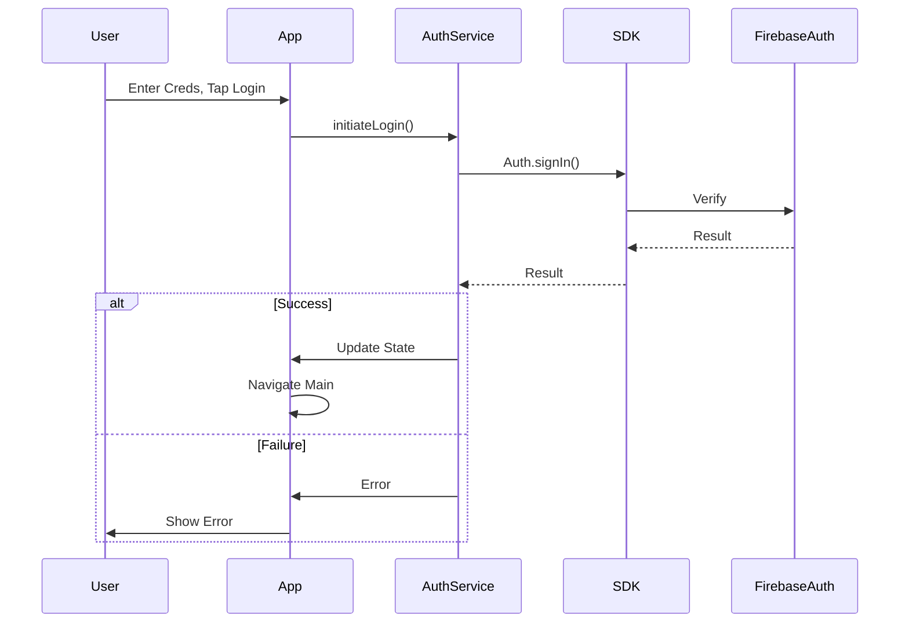

# Authentication and Authorization

## Auth Flow

Primarily client-side via Firebase Auth iOS SDK. Backend relies on trigger/Admin SDK context.



## Middleware/Guards

Authorization enforced mainly via Firestore Security Rules checking request.auth.uid.

**Example Rule**:

```javascript
match /conversations/{convId} { allow read: if request.auth.uid in resource.data.participants; }
```
