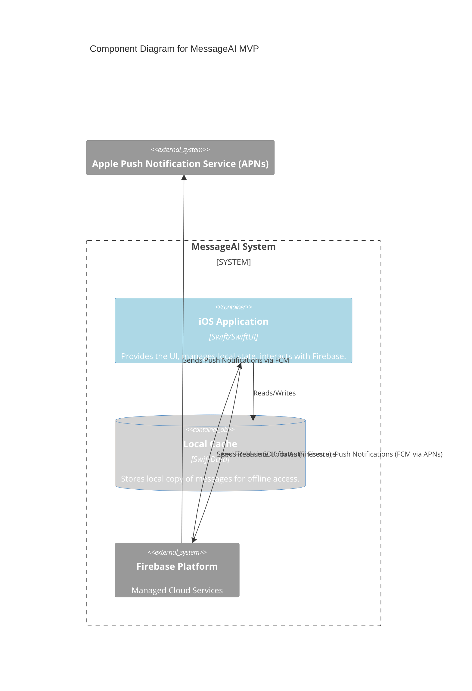
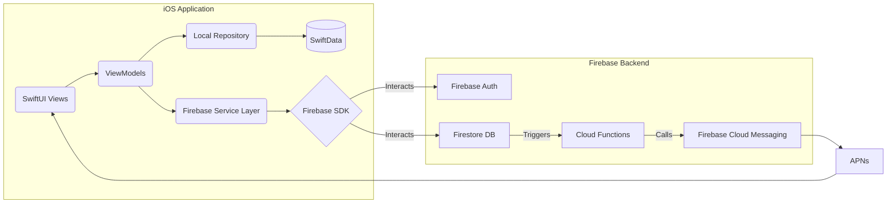

# Components

Based on the serverless architecture, native iOS client, and direct Firebase SDK integration, the major logical components and their responsibilities are:

## iOS Application (SwiftUI)

**Responsibility**: Provides the user interface, manages local application state, handles user input, interacts with local storage (SwiftData), and communicates directly with Firebase services (Auth, Firestore) via the Firebase SDK.

**Key Interfaces**: User Interface (Views), ViewModels (state and logic), Local Repository (SwiftData interaction), Firebase Service Layer (wrappers around Firebase SDK calls).

**Dependencies**: Firebase iOS SDK, SwiftData.

**Technology Stack**: Swift, SwiftUI, SwiftData.

## Firebase Authentication

**Responsibility**: Manages user sign-up, login, sessions, and provides user identity (UIDs).

**Key Interfaces**: Firebase Auth SDK methods (e.g., createUser, signIn, signOut, currentUser).

**Dependencies**: None (Managed Cloud Service).

**Technology Stack**: Firebase Cloud Service.

## Firebase Firestore

**Responsibility**: Stores and synchronizes application data (Users, Conversations, Messages) in real-time across connected clients. Enforces data access rules via Security Rules.

**Key Interfaces**: Firestore SDK methods (e.g., setData, updateData, addSnapshotListener, getDocuments). Firestore Security Rules.

**Dependencies**: None (Managed Cloud Service).

**Technology Stack**: Firebase Cloud Service (NoSQL Database).

## Firebase Cloud Functions

**Responsibility**: Executes server-side logic triggered by events (e.g., new Firestore documents). For MVP, its main role is triggering push notifications.

**Key Interfaces**: Firestore Triggers (e.g., onWrite, onCreate), FCM API.

**Dependencies**: Firebase Admin SDK, FCM SDK.

**Technology Stack**: Node.js, TypeScript.

## Firebase Cloud Messaging (FCM)

**Responsibility**: Delivers push notifications to iOS devices based on triggers from Cloud Functions.

**Key Interfaces**: FCM API (used by Cloud Functions), Apple Push Notification service (APNs) integration.

**Dependencies**: None (Managed Cloud Service).

**Technology Stack**: Firebase Cloud Service.

## Component Diagrams

