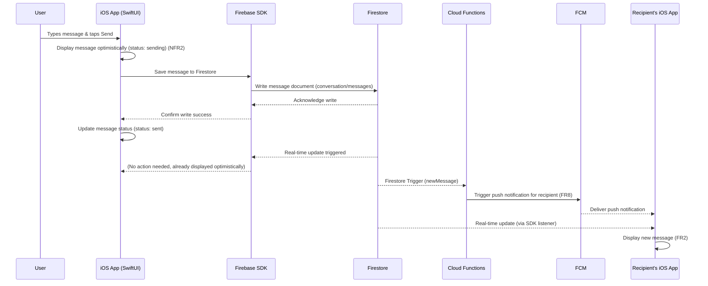
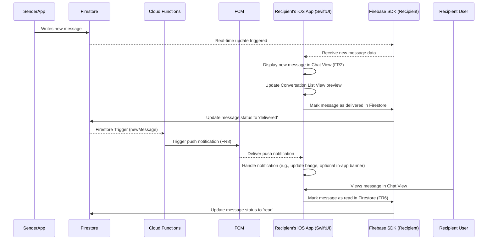
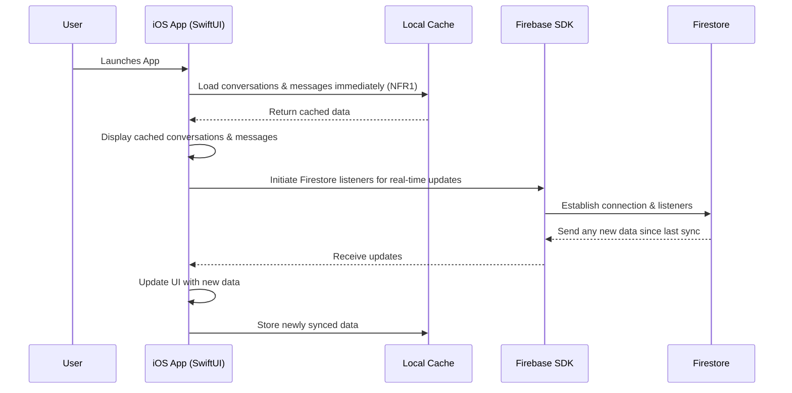

# Core Workflows

This section illustrates key system workflows using sequence diagrams.

## Workflow 1: User Sends a 1:1 Message (Online)

## Workflow 2: User Receives a Message (App in Foreground)

## Workflow 3: App Launch & Loading Messages (Offline First)

