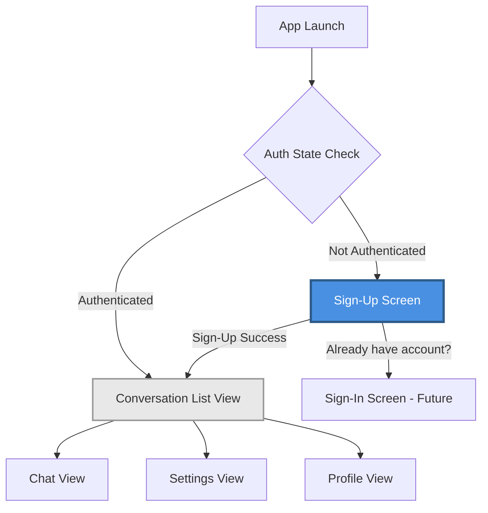
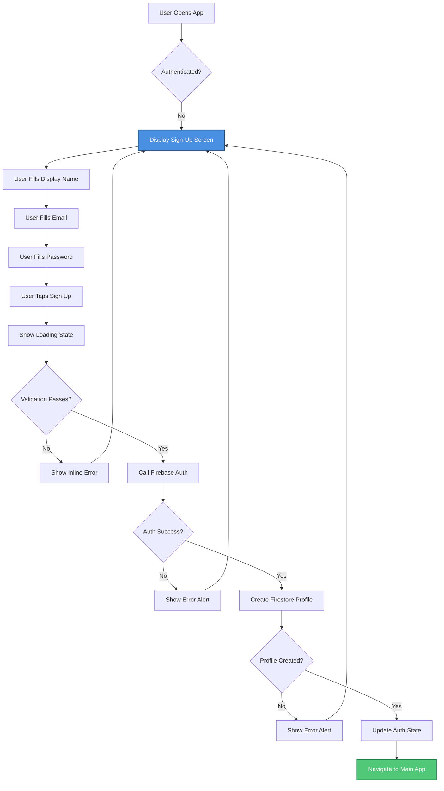
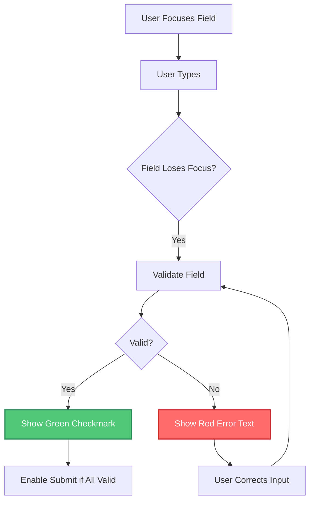

# Message AI UI/UX Specification

## Introduction

This document defines the user experience goals, information architecture, user flows, and visual design specifications for **Message AI's** sign-up screen (Story 1.1). It serves as the foundation for visual design and frontend development, ensuring a cohesive and user-centered experience.

### Overall UX Goals & Principles

#### Target User Personas

**New Messaging User:** Someone creating their first account in the Message AI app. They want a quick, frictionless sign-up process that gets them into the app as fast as possible. They value clarity over complexity and expect familiar iOS patterns.

#### Usability Goals

1. **Ease of learning:** New users can complete sign-up within 60 seconds
2. **Error prevention:** Clear validation prevents invalid inputs before submission
3. **Minimal friction:** All required fields (display name, email, password) on a single screen
4. **Accessibility:** WCAG AA compliant with full VoiceOver support and Dynamic Type

#### Design Principles

1. **Native First** - Use iOS native patterns and SwiftUI components exclusively; feels like a natural extension of iOS
2. **Clarity over cleverness** - Every element has a clear purpose; no decorative fluff
3. **Immediate feedback** - Real-time validation and loading states keep users informed
4. **Accessible by default** - Every design decision considers VoiceOver, Dynamic Type, and reduced motion
5. **Minimal and focused** - Single-screen flow with only essential elements; no branding distractions

#### Change Log

| Date | Version | Description | Author |
|------|---------|-------------|--------|
| 2025-10-20 | 1.0 | Initial UI/UX spec for Story 1.1 Sign-Up Screen | Sally (UX Expert) |

## Information Architecture (IA)

### Site Map / Screen Inventory



**Legend:**
- **Blue (highlighted):** Current scope - Sign-Up Screen (Story 1.1)
- **Gray:** Future screens referenced for context

### Navigation Structure

**Primary Navigation:**
- Sign-Up screen is the **entry point** for unauthenticated users
- Acts as a modal/full-screen blocking screen - no navigation chrome visible
- Cannot be dismissed or bypassed without authentication

**Secondary Navigation:**
- "Already have an account?" text button at bottom → navigates to Sign-In screen (future story)
- No back button (this is the root authentication screen)

**Post-Authentication Navigation:**
- On successful sign-up → automatic navigation to Conversation List View (main app)
- Navigation is unidirectional (no back button from main app to auth screens)
- AuthService.currentUser state drives navigation decision

**Breadcrumb Strategy:**
- N/A - Single-screen auth flow with no breadcrumb requirements

## User Flows

### Flow 1: Successful Sign-Up (Happy Path)

**User Goal:** Create a new account and access the messaging app

**Entry Points:** 
- App launch (when not authenticated)
- "Sign Up" navigation from future Sign-In screen

**Success Criteria:** 
- User account created in Firebase Auth
- User profile document created in Firestore
- User navigated to Conversation List View

#### Flow Diagram



#### Edge Cases & Error Handling:

**Validation Errors (Client-side):**
- Empty display name → "Display name is required"
- Display name < 2 characters → "Display name must be at least 2 characters"
- Invalid email format → "Please enter a valid email address"
- Password < 6 characters → "Password must be at least 6 characters"
- Network unavailable → "No internet connection. Please check your network."

**Firebase Auth Errors:**
- Email already exists → "This email is already registered. Try signing in instead."
- Weak password → "Password is too weak. Please use a stronger password."
- Invalid email → "Please enter a valid email address"
- Too many requests → "Too many attempts. Please try again later."
- Network error → "Connection failed. Please check your internet and try again."

**Firestore Errors:**
- Profile creation fails → "Account created but profile setup failed. Please restart the app."
- Permission denied → "Unable to create profile. Please contact support."

**Notes:** 
- All validation happens in real-time as user types (debounced by 300ms)
- Submit button disabled until all fields valid
- Loading state shows spinner on button with "Creating account..." text
- Errors displayed inline below respective fields for validation errors
- Errors displayed as iOS Alert for Firebase/network errors

### Flow 2: Form Validation & Real-Time Feedback

**User Goal:** Understand field requirements and fix errors before submission

**Entry Points:** User begins typing in any field

**Success Criteria:** User receives immediate feedback on field validity

#### Flow Diagram



#### Edge Cases & Error Handling:

- User taps "Sign Up" with empty fields → All empty fields show validation errors simultaneously
- User pastes content → Validation runs immediately after paste
- User uses autofill → Validation runs on all autofilled fields
- Field validation during typing → Show error only after field loses focus (onBlur), not while typing
- Password field → Show requirements hint below field, update as user types

**Notes:**
- Green checkmarks appear to the right of valid fields (provides positive feedback)
- Error text appears below invalid fields in red (SF Pro Text, 12pt)
- Submit button grayed out with 50% opacity when form invalid
- VoiceOver announces validation state changes

## Wireframes & Mockups

### Primary Design Files

**Primary Design Files:** N/A - This specification serves as the design source for MVP. Future iterations may include Figma mockups.

### Key Screen Layouts

#### Sign-Up Screen

**Purpose:** Enable new users to create an account with display name, email, and password in a single, focused screen.

**Key Elements:**

**Header Area:**
- App title "Message AI" (centered, SF Pro Display, 28pt, Bold)
- Subtitle "Create your account" (centered, SF Pro Text, 17pt, Regular, secondary text color)
- Vertical spacing: 60pt from safe area top to title, 12pt between title and subtitle

**Form Area (Vertical Stack, 16pt spacing between fields):**

1. **Display Name Field**
   - Label: "Display Name" (SF Pro Text, 15pt, secondary color)
   - TextField: Rounded rectangle, 44pt height, 16pt padding
   - Placeholder: "Enter your name"
   - Validation indicator: Green checkmark icon (right side, 20x20pt) when valid
   - Error message area below (red, 12pt, hidden by default)
   - Auto-capitalization: Words
   - VoiceOver label: "Display Name"

2. **Email Field**
   - Label: "Email" (SF Pro Text, 15pt, secondary color)
   - TextField: Rounded rectangle, 44pt height, 16pt padding
   - Placeholder: "you@example.com"
   - Validation indicator: Green checkmark icon when valid
   - Error message area below (red, 12pt, hidden by default)
   - Keyboard type: Email
   - Auto-capitalization: None
   - Autocorrect: Disabled
   - VoiceOver label: "Email address"

3. **Password Field**
   - Label: "Password" (SF Pro Text, 15pt, secondary color)
   - SecureField/TextField: Rounded rectangle, 44pt height, 16pt horizontal padding
   - Placeholder: "At least 6 characters"
   - Show/Hide Toggle: Eye icon button (inside field, trailing position, 8pt from right edge)
     - Closed eye icon (SF Symbol: eye.slash) when password hidden
     - Open eye icon (SF Symbol: eye) when password visible
     - Icon size: 20x20pt, tappable area: 44x44pt for accessibility
     - Color: Secondary/tertiary (matches label color)
     - VoiceOver label: "Show password" or "Hide password"
   - Validation indicator: Green checkmark icon when valid (inside field, left of show/hide button, 8pt spacing)
   - Password Strength Indicator (below field, 8pt spacing):
     - Visual: Horizontal bar (4pt height, full width, rounded 2pt corners)
     - States: 
       - Weak (< 8 chars): Red bar, 33% width, "Weak" label
       - Medium (8+ chars): Orange bar, 66% width, "Medium" label
       - Strong (12+ chars with mixed case/numbers): Green bar, 100% width, "Strong" label
       - Hidden until user starts typing
     - Label: 11pt, SF Pro Text, color matches bar
   - Helper text below strength indicator: "Must be at least 6 characters" (12pt, tertiary color)
   - Error message area below helper (red, 12pt, hidden by default)
   - VoiceOver label: "Password, secure text entry" (updates to "Password" when visible)

**Action Area:**
- Primary button: "Sign Up" (full width, 50pt height, rounded corners 12pt)
  - Enabled state: System blue background, white text (SF Pro Text, 17pt, Semibold)
  - Disabled state: 50% opacity
  - Loading state: Spinner (center) + "Creating account..." text
  - VoiceOver label: "Sign Up, button, double tap to activate"

**Footer Area:**
- Text: "Already have an account?" + "Sign In" link (inline)
- Text: SF Pro Text, 15pt, secondary color
- Link: System blue, 15pt, Semibold
- Centered horizontally, 24pt above safe area bottom
- VoiceOver: "Already have an account? Sign In, button"

**Spacing & Layout:**
- Horizontal padding: 24pt from screen edges
- Form area: Starts 40pt below subtitle
- Action button: 32pt below last form field
- Footer: 40pt below action button (or flexible spacing to stay near bottom)

**Interaction Notes:**

- **Keyboard behavior:**
  - Return key on Display Name → Focus Email field
  - Return key on Email → Focus Password field
  - Return key on Password → Submit form (if valid)
  - Toolbar: "Done" button to dismiss keyboard
  
- **Field focus:**
  - Blue border (2pt) on focused field
  - Gray border (1pt) on unfocused field
  - Red border (2pt) on invalid field (after validation)

- **Password visibility toggle:**
  - Tapping eye icon toggles between SecureField (hidden) and TextField (visible)
  - State persists until user taps again
  - VoiceOver announces state change: "Password now visible" or "Password now hidden"

- **Password strength calculation:**
  - Updates in real-time as user types
  - Weak: Less than 8 characters
  - Medium: 8+ characters
  - Strong: 12+ characters AND contains uppercase + lowercase + number
  - Minimum validation (6 chars) still required for submission

- **Loading state:**
  - Button shows spinner + text
  - All form fields disabled
  - Keyboard dismissed
  - User cannot navigate away

- **Error display:**
  - Alert for Firebase/system errors (standard iOS Alert)
  - Inline text for validation errors (slides down below field with animation)
  - VoiceOver reads error immediately when it appears

**Design File Reference:** N/A - Build directly from this specification

## Component Library / Design System

### Design System Approach

**Design System Approach:** Leverage native iOS components and SF Symbols for MVP. Build custom reusable components only where necessary to maintain consistency across future screens. Follow Apple Human Interface Guidelines (HIG) for iOS as the primary design authority.

**Rationale:** 
- SwiftUI provides robust, accessible native components out of the box
- SF Symbols library offers 5,000+ icons optimized for iOS
- Native components automatically adapt to Dark Mode, Dynamic Type, and accessibility settings
- Custom design system would be premature for single-screen MVP
- Future screens will reuse components defined here

### Core Components

#### Text Input Field Component

**Purpose:** Reusable text input component for forms with validation, icons, and error states

**Variants:**
- Standard TextField (text, email, phone, etc.)
- SecureField (password with toggle option)
- With validation indicator (checkmark)
- With trailing action button (show/hide toggle)

**States:**
- Default (unfocused, no content)
- Focused (active keyboard, blue border)
- Filled (has content)
- Valid (green checkmark visible)
- Invalid (red border, error text below)
- Disabled (grayed out, 50% opacity)

**Visual Specifications:**
- Height: 44pt (minimum iOS tap target)
- Corner radius: 10pt
- Horizontal padding: 16pt
- Border width: 1pt (default), 2pt (focused/error)
- Border colors:
  - Default: System gray (tertiary)
  - Focused: System blue
  - Error: System red
- Background: System background (adapts to light/dark mode)
- Text: SF Pro Text, 17pt, primary text color
- Placeholder: SF Pro Text, 17pt, tertiary text color

**Usage Guidelines:**
- Use for all text input needs (email, password, name, etc.)
- Always include label above field
- Show validation feedback after field loses focus (not while typing)
- Error messages appear below field in 12pt red text
- Checkmark appears inside field on trailing side when valid

---

#### Primary Button Component

**Purpose:** Call-to-action button for primary actions (Sign Up, Send, Save, etc.)

**Variants:**
- Default (enabled)
- Loading (with spinner)
- Disabled

**States:**
- Default: System blue background, white text
- Pressed: Slightly darker blue (system handles)
- Disabled: 50% opacity
- Loading: Spinner centered with optional text

**Visual Specifications:**
- Height: 50pt (comfortable tap target)
- Corner radius: 12pt
- Full width (with horizontal padding from parent)
- Text: SF Pro Text, 17pt, Semibold
- Loading spinner: Standard iOS spinner (white, 20pt)

**Usage Guidelines:**
- One primary button per screen (clear primary action)
- Button text should be action-oriented verb ("Sign Up", not "Submit")
- Disable button when form invalid (provides clear affordance)
- Show loading state with spinner during async operations
- VoiceOver label should describe action clearly

---

#### Validation Indicator Component

**Purpose:** Visual feedback icon indicating field validity

**Variants:**
- Success (green checkmark)
- Error (red X or exclamation) - optional, currently using border color

**States:**
- Hidden (default, before validation)
- Visible (after field validated)

**Visual Specifications:**
- Icon: SF Symbol `checkmark.circle.fill` (or `checkmark`)
- Size: 20x20pt
- Color: System green (#34C759 light mode, #30D158 dark mode)
- Position: Inside field, trailing side (with 8pt spacing from other icons)

**Usage Guidelines:**
- Show only after field validated and passes
- Provides positive feedback (not just error highlighting)
- Should not interfere with other trailing icons (show/hide toggle)
- VoiceOver announces "valid" when checkmark appears

---

#### Password Strength Indicator Component

**Purpose:** Visual feedback on password security strength

**Variants:**
- Weak (red)
- Medium (orange)
- Strong (green)

**States:**
- Hidden (no password entered yet)
- Visible (user has typed at least 1 character)

**Visual Specifications:**
- Bar height: 4pt
- Bar width: 33% (weak), 66% (medium), 100% (strong)
- Corner radius: 2pt
- Colors:
  - Weak: System red (#FF3B30 light, #FF453A dark)
  - Medium: System orange (#FF9500 light, #FF9F0A dark)
  - Strong: System green (#34C759 light, #30D158 dark)
- Label: 11pt SF Pro Text, positioned to right of bar
- Container: Full width, 8pt below password field

**Usage Guidelines:**
- Updates in real-time as user types
- Advisory only - does not block submission if meets minimum requirements
- Use simple algorithm for MVP: character count + complexity check
- Hide until user starts typing (don't show empty/weak on blank field)

---

#### Error Message Component

**Purpose:** Display inline validation error messages below form fields

**Variants:**
- Single-line error
- Multi-line error (rare)

**States:**
- Hidden (default)
- Visible (slides down with animation when error occurs)

**Visual Specifications:**
- Text: SF Pro Text, 12pt, Regular
- Color: System red
- Spacing: 4pt above error text (from field or last element)
- Animation: Slide down with 0.2s ease-out

**Usage Guidelines:**
- Always positioned directly below the related field
- Use clear, actionable language (tell user how to fix)
- One error per field (show most critical first)
- VoiceOver announces error immediately when it appears
- Error clears when user begins correcting the input

---

#### Alert Dialog Component

**Purpose:** Display system-level errors and important messages (uses native iOS Alert)

**Variants:**
- Error alert (red destructive style if applicable)
- Informational alert

**Visual Specifications:**
- Uses `UIAlertController` / SwiftUI `.alert()` modifier
- Standard iOS styling (no customization)
- Title: Bold, 17pt
- Message: Regular, 13pt
- Buttons: System styled

**Usage Guidelines:**
- Use for Firebase/network errors (unexpected system issues)
- Do NOT use for validation errors (use inline instead)
- Keep title short and descriptive ("Sign Up Failed")
- Message should explain what happened and what user can do
- Primary action button: "OK" or retry action
- Dismissible by tapping outside or OK button

## Branding & Style Guide

### Visual Identity

**Brand Guidelines:** No formal brand guidelines exist for MVP. Message AI follows a minimal, native iOS aesthetic that prioritizes function over branding. The app should feel like a natural extension of iOS rather than a heavily branded experience.

**Design Philosophy:** Clean, minimal, and professional. Let the messaging content be the focus, not the interface.

### Color Palette

| Color Type | Hex Code | Usage |
|-----------|----------|-------|
| Primary | System Blue (#007AFF light, #0A84FF dark) | Primary buttons, links, focused states, active elements |
| Secondary | N/A - Use System Gray hierarchy | Labels, secondary text, borders |
| Accent | System Blue (same as primary) | Highlights, selection states |
| Success | System Green (#34C759 light, #30D158 dark) | Positive feedback, confirmations, valid state indicators, strong passwords |
| Warning | System Orange (#FF9500 light, #FF9F0A dark) | Cautions, medium password strength |
| Error | System Red (#FF3B30 light, #FF453A dark) | Errors, destructive actions, validation failures, weak passwords |
| Neutral | System Gray hierarchy | Text (primary, secondary, tertiary), borders, backgrounds, dividers |

**Notes:**
- All colors use iOS system semantic colors that automatically adapt to Light/Dark mode
- Never hardcode hex values - use SwiftUI semantic color names (`.blue`, `.red`, `.green`, etc.)
- System handles contrast ratios and accessibility automatically
- Background colors: `.background` (primary), `.secondarySystemBackground`, `.tertiarySystemBackground`

### Typography

#### Font Families

- **Primary:** SF Pro (System default for iOS)
- **Secondary:** SF Pro Rounded (optional, for friendlier feel in future features)
- **Monospace:** SF Mono (for technical content, codes, IDs - if needed in future)

**Implementation:** Use SwiftUI's `.font()` modifier with system font styles (`.title`, `.body`, `.caption`, etc.) to ensure Dynamic Type support.

#### Type Scale

| Element | Size | Weight | Line Height | Usage |
|---------|------|--------|-------------|-------|
| H1 (Large Title) | 34pt | Bold | 41pt | Screen titles, major headings |
| H2 (Title 1) | 28pt | Bold | 34pt | App name on auth screens |
| H3 (Title 2) | 22pt | Bold | 28pt | Section headers |
| Body | 17pt | Regular | 22pt | Primary content, form fields, button text |
| Callout | 16pt | Regular | 21pt | Secondary descriptions |
| Subheadline | 15pt | Regular | 20pt | Field labels, supporting text |
| Footnote | 13pt | Regular | 18pt | Timestamps, metadata |
| Caption | 12pt | Regular | 16pt | Helper text, validation messages, password requirements |
| Caption 2 | 11pt | Regular | 13pt | Password strength labels, very small supporting text |

**Notes:**
- All sizes support Dynamic Type - users can scale text in Settings
- Use semantic font styles (`.title`, `.body`, `.caption`) not hardcoded sizes
- Line height automatically handled by system when using semantic styles
- Bold (700 weight), Semibold (600), Regular (400), Light (300)

### Iconography

**Icon Library:** SF Symbols 5+ (Apple's comprehensive icon system)

**Primary Icons Used in Sign-Up Screen:**
- `eye` - Show password (visible state)
- `eye.slash` - Hide password (secure state)
- `checkmark` or `checkmark.circle.fill` - Validation success indicator
- Icons automatically adapt to Dark Mode and Dynamic Type

**Usage Guidelines:**
- Use SF Symbols for all icons (5,000+ icons available)
- Icons scale with Dynamic Type automatically
- Standard icon sizes: 20pt (inline), 24pt (buttons), 28pt (navigation)
- Never use custom icon fonts or PNG icons for standard UI elements
- Color icons using system semantic colors for consistency
- Multicolor SF Symbols available for special cases (not used in MVP)

**Resources:** [SF Symbols App](https://developer.apple.com/sf-symbols/) for browsing available icons

### Spacing & Layout

**Grid System:** iOS uses an 8pt base grid system for consistency

**Spacing Scale:**
- **4pt** - Minimal spacing (between related micro-elements, icon spacing)
- **8pt** - Tight spacing (element gaps within a component, password strength indicator)
- **12pt** - Small spacing (subtitle below title, element separation)
- **16pt** - Standard spacing (form field vertical spacing, horizontal screen padding)
- **24pt** - Medium spacing (horizontal screen padding, section spacing, footer spacing)
- **32pt** - Large spacing (major section breaks, button spacing from form)
- **40pt** - Extra large spacing (form from header, footer from button)
- **60pt** - Spacious (header from safe area top)

**Safe Area Insets:**
- Always respect safe area insets (notch, home indicator, status bar)
- Use SwiftUI `.padding(.safeArea)` or layout within safe area
- Bottom elements should be 24pt minimum above safe area bottom

**Container Widths:**
- Form fields: Full width minus horizontal padding (24pt each side)
- Maximum content width: No constraint for MVP (single column, full width)
- Button: Full width minus horizontal padding

**Minimum Touch Targets:**
- 44x44pt minimum for all interactive elements (iOS HIG requirement)
- Applies to buttons, icons, links, form fields

## Accessibility Requirements

### Compliance Target

**Standard:** WCAG 2.1 Level AA (Web Content Accessibility Guidelines)

**iOS-Specific Standards:** Apple Human Interface Guidelines - Accessibility

**Target Users:**
- Users with visual impairments (low vision, color blindness, blindness)
- Users with motor impairments (reduced dexterity, tremors)
- Users with cognitive differences
- Users relying on assistive technologies (VoiceOver, Switch Control, Voice Control)

### Key Requirements

#### Visual

**Color contrast ratios:**
- **Text contrast:** Minimum 4.5:1 for normal text (< 18pt), 3:1 for large text (≥ 18pt or ≥ 14pt bold)
- **UI element contrast:** Minimum 3:1 for interactive elements, borders, focus indicators
- **System colors automatically meet requirements:** iOS semantic colors (blue, red, green, etc.) meet WCAG AA contrast ratios in both light and dark modes
- **Never rely on color alone:** Validation uses color + icon + text (checkmark icon AND green color, error text AND red border)
- **Test with color blindness simulators:** Ensure red/green distinction (weak/strong passwords) still works with icons/labels

**Focus indicators:**
- **Visible focus state:** 2pt blue border on focused text fields (default iOS behavior)
- **Minimum 3:1 contrast ratio** between focused and unfocused states
- **Focus order:** Logical top-to-bottom (Display Name → Email → Password → Sign Up button → Sign In link)
- **Keyboard navigation:** Tab/Return keys move focus in logical order
- **Always visible:** Focus indicator never hidden or removed

**Text sizing:**
- **Support Dynamic Type:** All text must scale with user's system text size preference (Accessibility → Display & Text Size)
- **Test at largest accessibility sizes:** AX1-AX5 text sizes (up to 53pt for body text)
- **Layout must adapt:** Forms should scroll if content exceeds screen height at large text sizes
- **No clipping:** Text must never be truncated or cut off at any size
- **Minimum touch targets maintained:** 44x44pt even when text scales

#### Interaction

**Keyboard navigation:**
- **Full keyboard support:** All interactive elements accessible via keyboard (Return, Tab)
- **Return key action:** Moves focus to next field, submits form on password field if valid
- **Keyboard shortcuts:** Standard iOS shortcuts work (e.g., Cmd+Tab for app switching)
- **Dismiss keyboard:** "Done" button in keyboard toolbar
- **No keyboard traps:** User can always navigate away from any element

**Screen reader support (VoiceOver):**
- **All elements labeled:** Every interactive element has meaningful accessibility label
- **Label examples:**
  - Display Name field: "Display Name, text field, required"
  - Email field: "Email address, text field, required"  
  - Password field: "Password, secure text entry, required, must be at least 6 characters"
  - Show/Hide button: "Show password, button" / "Hide password, button"
  - Sign Up button: "Sign Up, button, dimmed" (when disabled) or "Sign Up, button"
  - Validation checkmark: "Display Name is valid"
- **State changes announced:** "Password now visible", "Email is invalid", "Creating account"
- **Validation errors announced immediately:** "Error: Please enter a valid email address"
- **Hints provided:** Accessibility hints explain what will happen ("Double tap to show password")
- **Reading order logical:** Top to bottom matches visual order
- **Group related elements:** Form fields grouped logically for efficient navigation

**Touch targets:**
- **Minimum 44x44pt:** All interactive elements (buttons, fields, icons, links)
- **Icon buttons expand hit area:** Eye icon is 20x20pt but tappable area is 44x44pt
- **Adequate spacing:** 8pt minimum between adjacent interactive elements
- **Edge padding:** 24pt from screen edges prevents accidental edge touches
- **Full-width buttons:** "Sign Up" button is full width for easy targeting

#### Content

**Alternative text:**
- **Decorative icons:** Marked as decorative if purely visual (none in sign-up screen)
- **Functional icons:** Eye icon labeled "Show password" / "Hide password"
- **Checkmark icon:** Announced as "valid" or part of field state

**Heading structure:**
- **Logical hierarchy:** H1 ("Message AI") → H2 ("Create your account") → Form labels
- **Consistent structure:** Screen title always H1, subtitle H2, section headers H3
- **No skipped levels:** Don't jump from H1 to H3

**Form labels:**
- **Every field labeled:** Visible text label above each field (not just placeholder)
- **Labels associated:** Accessibility identifier links label to field
- **Required indicators:** VoiceOver announces "required" for all fields
- **Error association:** Error messages linked to their fields for screen reader context
- **Helper text included:** Password requirements included in accessibility description

### Testing Strategy

**Automated Testing:**
- **SwiftUI Accessibility Inspector:** Use Xcode's built-in accessibility inspector
- **Contrast Analyzer:** Verify all color combinations meet WCAG AA ratios
- **Command:** Test using keyboard-only navigation in simulator

**Manual Testing:**
- **VoiceOver testing (Required):**
  1. Enable VoiceOver (Settings → Accessibility → VoiceOver)
  2. Navigate entire sign-up flow using only gestures (no vision)
  3. Verify all elements announced correctly
  4. Test form completion and submission
  5. Test error states and announcements
- **Dynamic Type testing (Required):**
  1. Test at smallest text size (Settings → Display & Text Size)
  2. Test at largest accessibility size (AX5)
  3. Verify layout doesn't break, text doesn't clip
  4. Verify 44pt touch targets maintained
- **Keyboard navigation (Required):**
  1. Connect external keyboard to simulator/device
  2. Navigate using only Return/Tab keys
  3. Verify focus moves logically
  4. Verify all actions accessible without touch
- **Color blindness simulation (Recommended):**
  1. Use Xcode's Environment Overrides (Color Blindness filters)
  2. Test Protanopia, Deuteranopia, Tritanopia
  3. Verify password strength still distinguishable

**Device Testing:**
- Test on real device (not just simulator)
- Test with actual VoiceOver users if possible
- Test with iOS Accessibility Shortcut (triple-click side button)

**Test Cases for Story 1.1:**
- [ ] All form fields navigable with VoiceOver
- [ ] All validation states announced correctly
- [ ] Error messages announced immediately when they appear
- [ ] Show/hide password toggle works with VoiceOver
- [ ] Form completable using only keyboard (external keyboard)
- [ ] Layout adapts to largest Dynamic Type size (AX5)
- [ ] All touch targets minimum 44x44pt
- [ ] Color contrast ratios verified with inspector
- [ ] Focus indicators visible in both light and dark mode

## Responsiveness Strategy

### Target Devices

**Primary Target:** iPhone (iOS 16+)

**Screen Sizes:**
- iPhone SE (3rd gen): 375 x 667 pts (4.7" display)
- iPhone 13/14/15 Standard: 390 x 844 pts (6.1" display)
- iPhone 14/15 Plus: 428 x 926 pts (6.7" display)
- iPhone 15 Pro Max: 430 x 932 pts (6.9" display)

**Secondary Target (Future):** iPad (consideration for future stories, not MVP)

### Device Size Categories

| Category | Width Range | Target Devices | Implementation Notes |
|----------|-------------|----------------|---------------------|
| Compact (Portrait) | 320-430 pts | All iPhones in portrait | Primary design target, single-column layout |
| Compact (Landscape) | 568-932 pts | iPhones in landscape | Same layout as portrait, scrollable if needed |
| Regular (iPad - Future) | 768+ pts | iPad (not MVP scope) | Future consideration: multi-column layouts |

**MVP Scope:** Compact width only (iPhone portrait and landscape)

### Adaptation Strategy

**Layout Approach:**
- **Single-column, scrollable layout** for all iPhone sizes
- **Percentage-based widths** - Form elements use full available width minus fixed padding (24pt)
- **Safe Area respect** - All content respects safe area insets (notch, home indicator)
- **Vertical scrolling** - Content scrolls if it exceeds screen height (especially with large Dynamic Type)

**Sign-Up Screen Adaptations by Device:**

**iPhone SE (Smallest):**
- Form still comfortable with 24pt horizontal padding
- All content visible without scrolling at default text size
- May require scrolling with large Dynamic Type (expected behavior)
- Keyboard covers form - ensure active field scrolls into view above keyboard

**iPhone 15 Pro Max (Largest):**
- Extra vertical space used for breathing room (larger gaps feel more spacious)
- Consider max-width constraint in future if form feels too stretched (not MVP)
- Same layout as smaller phones - consistency over optimization

**Landscape Orientation:**
- Same single-column layout
- Content scrolls vertically (keyboard covers most of screen in landscape)
- Keyboard automatically provides "Done" button for dismissal
- No special landscape-specific layout needed for auth screen

### Adaptation Patterns

**Layout Changes:**
- **No breakpoints needed** - Single responsive layout works for all iPhone sizes
- **Flexible spacing** - Footer "Already have an account?" uses flexible spacing to stay near bottom on large screens, but scrolls on small screens if needed
- **ScrollView container** - Entire form wrapped in ScrollView for keyboard avoidance and Dynamic Type support

**Navigation Changes:**
- **N/A for auth screen** - Full-screen blocking view, no navigation chrome
- **Future consideration:** Main app will use standard iOS navigation patterns (tab bar collapses in landscape, etc.)

**Content Priority:**
- **All content essential** - No content hiding based on screen size for sign-up screen
- **Future consideration:** Conversation list may show/hide secondary info on smaller screens

**Interaction Changes:**
- **No interaction differences** - Touch and keyboard work consistently across all sizes
- **Keyboard handling:** iOS automatic keyboard avoidance (SwiftUI handles scrolling active field into view)

### Implementation Guidelines

**SwiftUI Modifiers:**
```swift
.frame(maxWidth: .infinity) // Full width for form elements
.padding(.horizontal, 24) // Fixed horizontal padding
.ignoresSafeArea(.keyboard, edges: .bottom) // Keyboard pushes content up
```

**Safe Area:**
- Use `.safeAreaInset()` for content that should respect safe area
- Form content should be within safe area (not extend into notch or home indicator)

**Keyboard Handling:**
- SwiftUI's automatic keyboard avoidance sufficient for MVP
- iOS scrolls active field into view automatically
- Keyboard toolbar with "Done" button for dismissal

**Testing Requirements:**
- Test on smallest device (iPhone SE simulator)
- Test on largest device (iPhone 15 Pro Max simulator)
- Test in both portrait and landscape
- Test with keyboard visible in all configurations
- Test with largest Dynamic Type size on smallest device (worst-case scenario)

## Animation & Micro-interactions

### Motion Principles

**Design Philosophy:** Subtle, purposeful, and respectful

**Core Principles:**
1. **Purposeful motion** - Every animation serves a function (feedback, guidance, or relationship)
2. **Subtle and fast** - Animations should feel instant (100-300ms), never slow down the user
3. **Respect user preferences** - Honor "Reduce Motion" accessibility setting
4. **iOS-native feel** - Use system animation curves and timings
5. **Performant** - 60fps minimum, smooth on older devices (iPhone SE)

**Animation Curve Standard:** 
- Use iOS system curves: `.easeOut`, `.easeInOut`, `.spring()`
- Avoid linear animations (feel robotic)
- Spring animations for interactive elements (natural, fluid feel)

**Reduce Motion Support:**
- When user enables Reduce Motion, replace animations with instant state changes or simple fades
- Test all animations with Reduce Motion enabled
- SwiftUI: Use `@Environment(\.accessibilityReduceMotion) var reduceMotion`

### Key Animations

#### Validation Error Slide-In

**Purpose:** Draw attention to validation error below field
- **Trigger:** Field validation fails (on blur or submit attempt)
- **Animation:** Error text slides down from field
- **Duration:** 0.2s
- **Easing:** `.easeOut`
- **Reduce Motion:** Cross-fade only (no slide)
- **Notes:** Accompanied by VoiceOver announcement of error

#### Field Focus State

**Purpose:** Provide clear feedback when field becomes active
- **Trigger:** User taps field or tabs to it via keyboard
- **Animation:** Border color transitions to blue, border thickness increases 1pt→2pt
- **Duration:** 0.15s
- **Easing:** `.easeInOut`
- **Reduce Motion:** Instant state change (no transition)
- **Notes:** Subtle scale effect on focus could be added in future (1.0→1.02)

#### Validation Checkmark Appearance

**Purpose:** Provide positive feedback when field becomes valid
- **Trigger:** Field validation passes
- **Animation:** Checkmark fades in with slight scale (0.8→1.0)
- **Duration:** 0.25s
- **Easing:** `.spring(response: 0.3, dampingFraction: 0.7)`
- **Reduce Motion:** Fade in only (no scale)
- **Notes:** Satisfying "pop" feel, celebrates user success

#### Button Loading State

**Purpose:** Indicate processing and prevent multiple taps
- **Trigger:** User taps "Sign Up" button, form submits
- **Animation:** Button content fades out, spinner fades in, button slightly compresses
- **Duration:** 0.2s (transition), infinite (spinner rotation)
- **Easing:** `.easeInOut` for transitions
- **Reduce Motion:** No spinner animation, show static "..." text instead
- **Notes:** Disable button during loading to prevent interaction

#### Password Strength Bar Growth

**Purpose:** Provide real-time feedback on password quality
- **Trigger:** User types in password field
- **Animation:** Bar width animates from current width to new width, color transitions
- **Duration:** 0.3s
- **Easing:** `.spring(response: 0.4, dampingFraction: 0.8)`
- **Reduce Motion:** Instant width/color change
- **Notes:** Smooth, fluid feel as user types, debounce to avoid jank

#### Show/Hide Password Toggle

**Purpose:** Smooth transition between secure and visible password
- **Trigger:** User taps eye icon
- **Animation:** Icon crossfades between eye/eye.slash, password text crossfades
- **Duration:** 0.15s
- **Easing:** `.easeInOut`
- **Reduce Motion:** Instant swap (no fade)
- **Notes:** Quick transition, doesn't interrupt user's reading flow

#### Button Press Feedback

**Purpose:** Provide tactile feedback that button was pressed
- **Trigger:** User touches button
- **Animation:** Subtle scale down (1.0→0.97) while pressed, bounce back on release
- **Duration:** 0.1s press, 0.2s release
- **Easing:** `.spring()` on release
- **Reduce Motion:** Opacity change only (1.0→0.7→1.0)
- **Notes:** iOS system buttons do this automatically in SwiftUI

#### Navigation Transition (Sign-Up → Main App)

**Purpose:** Smooth transition after successful account creation
- **Trigger:** Account creation succeeds, navigating to Conversation List
- **Animation:** Push transition (right to left slide)
- **Duration:** 0.35s (iOS system default)
- **Easing:** iOS system navigation curve
- **Reduce Motion:** Crossfade transition
- **Notes:** Use standard NavigationStack transition, don't customize

### Animation Implementation Notes

**SwiftUI Code Pattern:**
```swift
// Example: Validation error slide-in
@State private var showError = false

// In view
if showError {
    Text("Error message")
        .transition(.move(edge: .top).combined(with: .opacity))
        .animation(.easeOut(duration: 0.2), value: showError)
}

// With Reduce Motion support
@Environment(\.accessibilityReduceMotion) var reduceMotion

.animation(reduceMotion ? nil : .easeOut(duration: 0.2), value: showError)
```

**Performance Considerations:**
- Use `.animation()` modifier sparingly (only on state that changes)
- Avoid animating layout changes unnecessarily
- Test on iPhone SE (oldest supported device) for performance
- Use Instruments to profile animation performance if issues arise

**Haptic Feedback (Future Enhancement):**
- Consider adding haptic feedback for validation errors (light impact)
- Consider haptic for successful submission (success notification)
- Not required for MVP, easy to add later

### Micro-interactions Inventory

| Element | Interaction | Feedback | Duration |
|---------|-------------|----------|----------|
| Text Field Focus | Tap or Tab to focus | Blue border + thickness increase | 0.15s |
| Text Field Validation | Blur with valid input | Green checkmark pop-in | 0.25s |
| Text Field Error | Blur with invalid input | Error text slide down + red border | 0.2s |
| Password Strength Bar | Type in password | Bar width/color animate | 0.3s |
| Show/Hide Toggle | Tap eye icon | Icon crossfade | 0.15s |
| Sign Up Button | Tap button | Scale down while pressed | 0.1s press |
| Button Loading | Form submit | Content fade out, spinner fade in | 0.2s |
| Navigation Transition | Account created | Slide left to main app | 0.35s |

**Total Animation Budget:** ~2 seconds max from screen load to submit (feels instant)

## Performance Considerations

### Performance Goals

**Page Load:**
- **App launch to sign-up screen visible:** < 1 second (cold start)
- **Screen transition:** < 0.5 seconds
- **Target:** Near-instant feel on iPhone 13 and newer, acceptable on iPhone SE

**Interaction Response:**
- **Field focus response:** < 100ms (imperceptible delay)
- **Validation feedback:** < 50ms after field blur
- **Button tap response:** < 100ms (visual feedback starts immediately)
- **Target:** Every interaction feels instant and responsive

**Animation FPS:**
- **Target:** 60 FPS for all animations
- **Minimum acceptable:** 60 FPS on iPhone SE (oldest supported device)
- **Test with:** Xcode Instruments (Core Animation profiler)

### Design Strategies

**Minimize Initial Load:**
- **Leverage SwiftUI lazy loading:** Views only rendered when needed
- **No images on sign-up screen:** Text and SF Symbols only (no asset loading)
- **Firebase SDK initialized at app launch:** Don't wait until sign-up attempt
- **Avoid over-rendering:** Use `Equatable` conformance for custom views to prevent unnecessary redraws

**Optimize Validation:**
- **Debounce real-time validation:** Wait 300ms after user stops typing before validating
- **Client-side validation first:** Catch errors before network call (email format, password length)
- **Validation logic simple:** Regex for email, character count for password (no expensive operations)
- **Avoid blocking UI:** Validation runs on background thread if needed (should be instant anyway)

**Efficient State Management:**
- **@Published properties minimal:** Only publish state that affects UI
- **Combine pipelines efficient:** Use `.debounce()`, `.removeDuplicates()` to reduce updates
- **Avoid excessive @State:** Group related state into single object when possible
- **SwiftUI updates optimized:** Use `id()` modifier carefully to control view identity

**Network Efficiency:**
- **Single network call:** Sign-up process combines auth + profile creation (minimize round trips)
- **Timeout handling:** 30-second timeout for Firebase operations
- **No polling on auth screen:** Static screen, no real-time updates needed
- **Firebase SDK optimizations:** Use Firebase default settings (already optimized)

**Animation Performance:**
- **Simple transforms only:** Use opacity, scale, position (GPU-accelerated)
- **Avoid layout animations:** Don't animate constraints unnecessarily
- **Spring animations optimized:** Use reasonable spring parameters (not overly bouncy)
- **Reduce Motion support:** Instant state changes or fades (more performant than motion)
- **Test on device:** Simulator may not reflect real performance

**Memory Management:**
- **No memory leaks:** Properly manage observation lifecycle (@StateObject vs @ObservedObject)
- **Release keyboard:** Dismiss keyboard before navigation to free memory
- **Firebase listeners cleaned up:** No active listeners on auth screen (stateless)
- **Image caching N/A:** No images on sign-up screen

**Keyboard Performance:**
- **Keyboard shows quickly:** iOS system-managed (no custom keyboard)
- **Smooth scroll during keyboard appearance:** SwiftUI automatic keyboard avoidance
- **No lag during typing:** Text fields use native UIKit text input system (optimized by Apple)

### Implementation Best Practices

**SwiftUI Performance:**
```swift
// ✅ Good: Debounced validation
.onChange(of: email) { newValue in
    Task {
        try? await Task.sleep(nanoseconds: 300_000_000) // 300ms debounce
        validateEmail(newValue)
    }
}

// ✅ Good: Minimal published properties
@Published var email: String = ""
@Published var isLoading: Bool = false

// ❌ Avoid: Publishing everything
@Published var emailCharacterCount: Int = 0 // Compute in view instead
```

**Validation Performance:**
```swift
// ✅ Good: Simple, fast validation
func isValidEmail(_ email: String) -> Bool {
    let emailRegex = "[A-Z0-9a-z._%+-]+@[A-Za-z0-9.-]+\\.[A-Za-z]{2,64}"
    return NSPredicate(format:"SELF MATCHES %@", emailRegex).evaluate(with: email)
}

// ❌ Avoid: Complex validation on UI thread
func isValidEmail(_ email: String) async -> Bool {
    // Don't make network call to verify email exists during typing!
}
```

**State Management:**
```swift
// ✅ Good: Grouped related state
struct FormState {
    var displayName: String = ""
    var email: String = ""
    var password: String = ""
}

// ❌ Avoid: Too many individual @State properties cluttering view
@State private var displayName: String = ""
@State private var displayNameValid: Bool = false
@State private var displayNameError: String? = nil
// ... repeated for each field
```

### Performance Testing

**During Development:**
- Run app on physical iPhone SE device (not just simulator)
- Use Xcode Instruments to profile:
  - Time Profiler (identify slow code paths)
  - Core Animation (verify 60 FPS)
  - Allocations (check for memory leaks)
- Monitor Xcode debugger console for SwiftUI performance warnings

**Before Release:**
- Test cold launch time from device home screen
- Test with poor network conditions (Network Link Conditioner)
- Test on oldest supported device (iPhone SE 3rd gen)
- Verify animations smooth with Reduce Motion enabled
- Profile memory usage (should be minimal for auth screen)

**Acceptance Criteria for Performance:**
- [ ] App launches in < 1 second (cold start on iPhone 13)
- [ ] All animations run at 60 FPS on iPhone SE
- [ ] Field interactions respond in < 100ms
- [ ] Validation feedback appears in < 50ms after blur
- [ ] Sign-up submission completes in < 3 seconds (good network)
- [ ] No memory leaks detected in Instruments
- [ ] Smooth keyboard appearance/dismissal

### Performance Anti-patterns to Avoid

**Don't:**
- ❌ Validate on every keystroke without debouncing
- ❌ Make network calls during typing (wait for submit)
- ❌ Render invisible views (SwiftUI should handle, but verify)
- ❌ Use `.onChange()` for state that doesn't affect UI
- ❌ Animate layout constraints (use transforms instead)
- ❌ Create new objects in body (use computed properties or @State)
- ❌ Ignore Reduce Motion setting (accessibility + performance)

**Do:**
- ✅ Debounce expensive operations (validation, search, etc.)
- ✅ Use `Equatable` for complex child views
- ✅ Leverage SwiftUI's built-in optimizations
- ✅ Test on real devices, not just simulator
- ✅ Profile with Instruments before declaring "done"
- ✅ Keep view hierarchies shallow when possible
- ✅ Use `.id()` modifier intentionally to control view identity

## Next Steps

### Immediate Actions

1. **Review this specification with stakeholders**
   - Product Owner review: Validate UX goals align with product vision
   - Dev team review: Ensure technical feasibility and clarify any questions
   - Estimated review time: 30 minutes

2. **Developer handoff to James (Full Stack Developer)**
   - James should read this complete UI/UX specification before starting Story 1.1 implementation
   - This spec provides all UI/UX requirements - no additional design mockups needed for MVP
   - James can reference this document throughout development for design decisions

3. **Set up Firebase project (prerequisite)**
   - Create Firebase project in Firebase Console
   - Add iOS app to Firebase project
   - Download GoogleService-Info.plist
   - Enable Firebase Authentication (Email/Password provider)
   - Set up Firestore database with initial security rules

4. **Begin Story 1.1 implementation**
   - James follows Story 1.1 tasks sequentially
   - This UI/UX spec addresses all design aspects of Task 5 (Create Sign-Up View UI)
   - Component specifications guide implementation across all tasks

5. **Schedule design review after initial implementation**
   - Review built UI against this specification
   - Validate accessibility requirements met
   - Test on multiple device sizes
   - Iterate based on findings

### Design Handoff Checklist

- [x] All user flows documented
- [x] Component inventory complete
- [x] Accessibility requirements defined
- [x] Responsive strategy clear
- [x] Brand guidelines incorporated (native iOS aesthetic)
- [x] Performance goals established
- [x] Animation specifications provided
- [x] Error states and edge cases covered
- [x] VoiceOver labels specified
- [x] Testing strategy documented

### Open Questions & Decisions Needed

**Resolved:**
- ✅ Firebase branding: Not shown (minimal approach)
- ✅ Display name field: On same screen as email/password
- ✅ Password show/hide toggle: Included
- ✅ Password strength indicator: Included
- ✅ Custom brand colors: Stick with system colors for now, plan for easy theming later

**No outstanding questions** - Specification is complete and ready for development.

### Future Considerations (Post-MVP)

**Design System Evolution:**
- Expand component library as new screens are built (Sign In, Chat, Settings)
- Create shared SwiftUI components in dedicated `Components/` folder
- Consider Figma design file for visual mockups if team grows
- Document additional patterns as they emerge

**Sign-Up Screen Enhancements (Future Stories):**
- Social authentication (Sign in with Apple, Google)
- Email verification flow
- Password reset link
- Profile photo upload during sign-up
- Multi-step sign-up wizard (if more data needed)
- Onboarding screens after sign-up

**Accessibility Improvements:**
- User testing with VoiceOver users
- Additional language support (internationalization)
- Haptic feedback for key interactions
- Voice Control optimization

**Analytics & Optimization:**
- Track sign-up completion rates
- Identify drop-off points in form
- A/B test validation strategies
- Monitor performance metrics in production

### Developer Notes for James

**Key Files to Create (Story 1.1):**
- `SignUpView.swift` - Implements this complete UI specification
- `AuthViewModel.swift` - Handles form state and validation logic
- `AuthService.swift` - Firebase Auth wrapper
- `FirestoreService.swift` - Firestore operations
- Consider: `ValidationHelpers.swift` - Reusable validation functions
- Consider: `FormField.swift` - Reusable text field component

**Design Implementation Tips:**
1. Build component-first: Create reusable `ValidatedTextField` component
2. Use SwiftUI Previews extensively to match specifications
3. Test on device early and often (simulator doesn't show true performance)
4. Implement Reduce Motion support from the start (don't retrofit)
5. Use Xcode Accessibility Inspector to validate VoiceOver labels
6. Keep color/spacing values in central Theme file for easy theming later

**Reference This Spec For:**
- Exact text labels and copy (error messages, button text, etc.)
- VoiceOver accessibility labels
- Spacing values (8pt grid system)
- Animation durations and easing curves
- Color choices and semantic naming
- Font sizes and weights
- Component states (focus, error, disabled, loading)

**When Stuck:**
- Re-read relevant section of this spec
- Check iOS Human Interface Guidelines for iOS conventions
- Ask Sally (UX Expert) for clarification on design decisions
- Prioritize functionality over pixel-perfection for MVP (iterate later)

### Success Metrics (Post-Launch)

**User Experience Metrics:**
- Sign-up completion rate > 80%
- Average time to complete sign-up < 60 seconds
- Validation error rate < 10% (indicates clear requirements)
- Accessibility: VoiceOver users can complete sign-up successfully

**Technical Metrics:**
- App launch time < 1 second (P95)
- All animations at 60 FPS (iPhone SE+)
- Zero crashes during sign-up flow
- Firebase Auth success rate > 99%

**Quality Metrics:**
- Zero accessibility violations (WCAG AA)
- All test cases pass (Story 1.1 acceptance criteria)
- Code review approved
- QA testing passed

---

## Document Complete

This UI/UX specification provides complete design guidance for Story 1.1: New User Account Creation. James (Developer) can now implement the sign-up screen with all necessary design details.

**Questions?** Ask Sally (UX Expert) for clarification or design guidance.

**Ready for development!** 🚀

